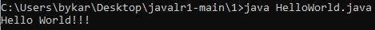
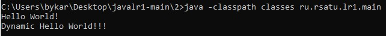
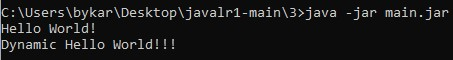

= Отчет по лабораторной работе 1
:listing-caption: Листинг
:source-highlighter: coderay

Студент: Курочкин Егор

Группа: ПИМ-22

== 1. Постановка задачи

В процессе выполнения лабораторной работы необходимо выполнить следующие задачи:

. Создать исполняемый java класс, который выводит текстовую строку на экран
. Разработать два класса. Первый класс вызывает 2 метода из второго класса (статический и нестатический)
. Создать jar-файл, хранящий элементы из предыдущего задания

== 2. Разработка задачи

=== 2.1 Структура проекта

Проект разделен на следующие директории:

docs::
Данная документация

1::
Код задачи 1. Исполняемый java-класс, выводящий текстовую строку на экран.

2::

2/src:::
Исходный код задачи 2. 2 java класса. Класс main.java вызывает 2 метода из класса
HelloWorld.java (статический и нестатический)

2/classes:::
Скомпилированные классы задачи 2

3::
Содержит manifest.mf и сгенерированный jar-файл

== 3. Информация о реализации

Сначала были созданы необходимые директории.

.Создание директорий
----
mkdir 1
mkdir -p 2/src/ru/rsatu/lr1
mkdir 2/classes
mkdir 3
mkdir -p doc/img
----

=== 3.1 Задание 1

Для выполнения первого задания был создан исполняемый класс HelloWorld.

.Листинг класса HelloWorld

[source,java]
----
public class HelloWorld {
    public static void main(String[] args) {
        System.out.println("Hello World!!!");
    }
}
----

Для компиляции файла в командной строке использовалась команда javac

.Команда javac
----
javac HelloWorld.java
----

Для запуска файла в командной строке использовалась команда java.

.Команда java
----
java HelloWorld
----

Результат работы скомпилированного файла

.Результат работы
----
Hello World!!!
----

=== 3.2 Задание 2

Для выполнени задания 2, класс HelloWorld был модифицирован следующим образзом.

.Класс HelloWorld
[source,java]
----
package ru.rsatu.lr1;

public class HelloWorld {
    static String Hello = "Hello ";
    public static void printHello(String name) {
        System.out.println(Hello+name+"!");
    }

    public void helloDynamic(String name) {
        System.out.println("Dynamic Hello "+name+"!!!");
    }
}
----

А так же был создан исполняемый класс main.

.Класс main
[source,java]
----
package ru.rsatu.lr1;

import ru.rsatu.lr1.HelloWorld;

public class main {
    public static void main(String[] args) {
        HelloWorld.printHello("World");

        HelloWorld hello = new HelloWorld();
        hello.helloDynamic("World");
    }
}
----

Для компиляции класса использовались следующие команды:

.Компиляция классов HelloWorld и main
----
javac -classpath classes/ -d classes/ src/ru/rsatu/lr1/HelloWorld.java
javac -classpath classes/ -d classes/ src/ru/rsatu/lr1/main.java
----

Затем файл main был запущен командой java.

.Запуск класса main
----
java -classpath classes ru.rsatu.lr1.main
----

И были получены следующие результаты работы.

.Результаты работы класса main
----
Hello World!
Dynamic Hello Wrld!!!
----

=== 3.3 Задание 3

Для выполнения третьего задания был создан файл manifest.mf, в котором указан
главные исполняемый класс main

.Листинг manifest.mf
[source,java]
----
Manifest-Version: 1.0
Created-By: 1.6.0_19 (Sun Microsystems Inc.)
Main-Class: ru.rsatu.lr1.main
----

После этого была выполнена команда по сборке архива jar и запуск jar-файла

.Команда по сборке архива
----
jar cvmf manifest.mf main.jar -C ../2/classes ru/rsatu/lr1
----

.Запуск jar-файла
----
java -jar main.jar
----

В результате выполнения выводится следующее:

.Результат выполнения
----
Hello World!
Dynamic Hello Wrld!!!
----

== 4. Результаты выполнения

В результате выполнения первого задания был получен класс HelloWorld.
При запуске выводится строка:

В результате выполнения второго задания были получены классы HelloWorld и main.
При запуске main выводятся строки:

В результате выполнения третьего задания был получен jar-файл main.jar.
При запуске jar-файла выводятся строки:

== 5. Вывод

В результате выполнения лабораторной работы получены навыки по компиляции классов,
запуску проектов, созданию jar-файлов с помощью командной строки.
